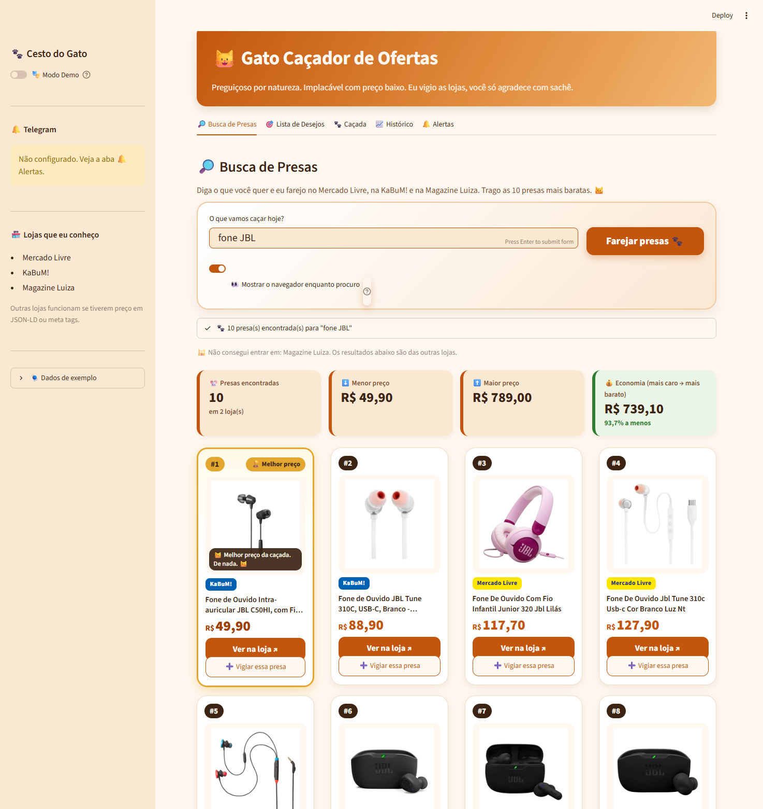
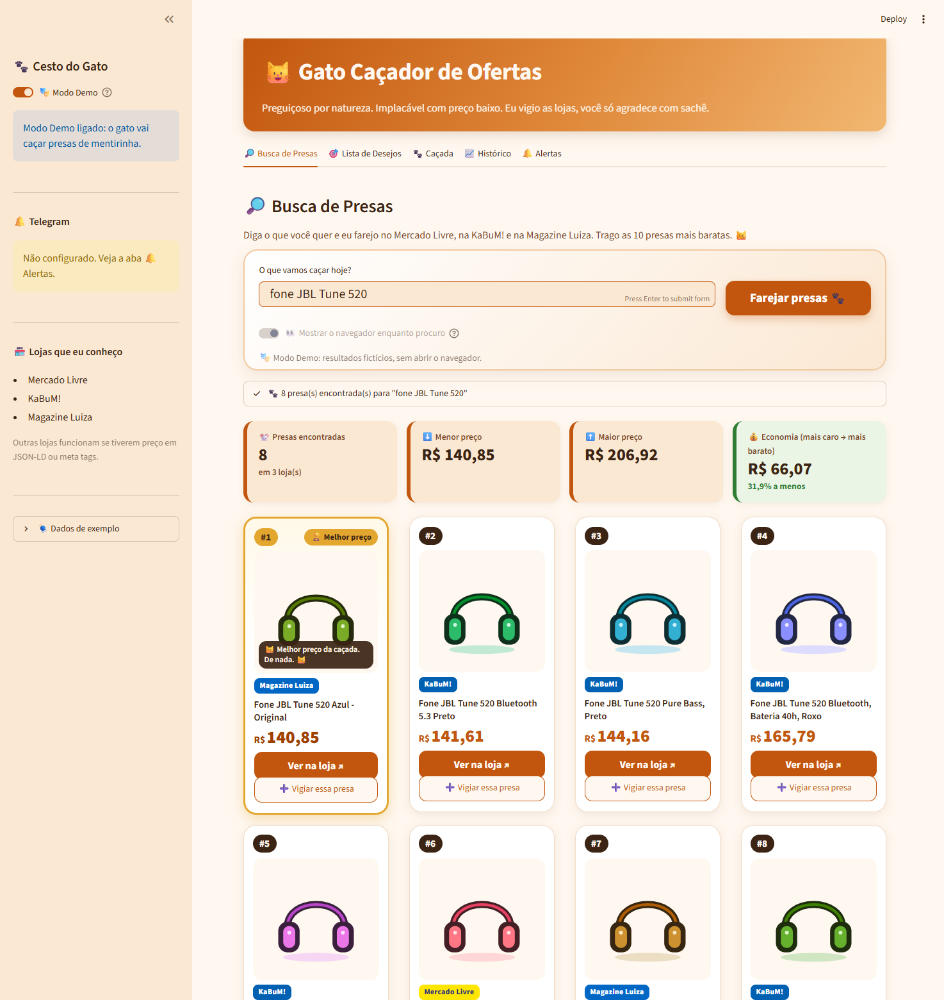
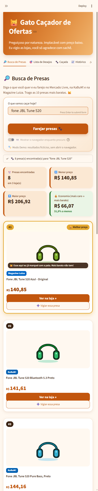

# 🐱 Gato Caçador de Ofertas

> *"Acordei da soneca... vamos ver se tem presa hoje. 😼"*

Uma automação **RPA em Python** que vigia preços de produtos em lojas online e mia no seu Telegram quando o preço cai.
Você monta a lista de desejos, define quanto quer pagar, e o gato faz o resto: abre o navegador, visita cada loja, captura o preço, guarda o histórico e dá o bote quando a presa (o preço baixo) aparece.



---

## 🔎 Busca de Presas (o destaque)

Digite um produto (ex.: **"fone JBL Tune 520"**), aperte **Enter** ou clique em **Farejar presas 🐾**, e o gato:

1. abre o navegador com Selenium e pesquisa o termo na **URL de busca** de cada loja cadastrada (veja a lista abaixo), **uma loja por vez**, com uma pequena pausa entre elas;
2. espera os cartões de resultado com `WebDriverWait` e coleta **até 5 resultados válidos por loja**: título, preço, loja, link e foto;
3. **pula** anúncios patrocinados, itens sem preço e itens **irrelevantes**;
4. junta tudo, **remove duplicados**, ordena do **menor para o maior preço** e mostra **no máximo as 10 presas mais baratas** (se achar só 5, mostra 5, sem espaços vazios);
5. exibe tudo numa **grade de cards** com foto, ranking, preço em destaque, selo da loja e botão **"Ver na loja"**. O **#1** ganha borda dourada, o selo **🏆 Melhor preço** e uma fala do gato;
6. em cada card, o botão **➕ Vigiar essa presa** manda o produto para a **Lista de Desejos** com uma meta sugerida **10% abaixo** do preço atual. É a ponte entre a busca e o monitoramento.

Acima da grade fica um resumo com a quantidade de presas, o menor e o maior preço e a **economia** entre eles (em R$ e %).

### 🏪 Lojas

Escolhi as lojas que fazem sentido para mim no momento, misturando lojas gerais e especializadas. Nada impede de adicionar outras (veja [Adicionando outra loja](#adicionando-outra-loja)).

| Loja | Tipo |
|---|---|
| Mercado Livre | geral |
| Amazon | geral |
| KaBuM! | informática e eletrônicos |
| Pichau | informática e eletrônicos |
| Terabyte | informática e eletrônicos |
| Kalunga | informática e papelaria |
| Fast Shop | eletrônicos e eletrodomésticos |
| Época Cosméticos | beleza |
| Centauro | esporte |

Testadas e deixadas de fora porque bloqueiam o robô: Magazine Luiza, Beleza na Web, Netshoes e Shopee.
Com 9 lojas, uma busca leva em torno de 1 minuto.

| Desktop (Modo Demo) | Celular |
|---|---|
|  |  |

**Cuidados técnicos da coleta** (em [`cacador/busca.py`](cacador/busca.py)):

- **Seletores por loja** (campo de busca via URL, cartão, título, preço, link, imagem, marcador de patrocinado) ficam no bloco `"busca"` de [`cacador/lojas.py`](cacador/lojas.py), fáceis de ajustar.
- **Preço "de/por"**: o seletor aponta para o preço atual (o "por"). O riscado (`<s>`, `line-through`) é ignorado, e preços no formato brasileiro são convertidos corretamente.
- **Fotos com lazy loading**: tenta `data-src` → `data-original` → `srcset` (a maior) → `src`, descartando placeholders (base64 minúsculo, "blank", "placeholder"). Depois **confere se a foto abre de verdade**, com HTTP 200 e `Content-Type: image/*`. Se não abrir, busca a `og:image` da página do produto, e se mesmo assim não houver foto usa a ilustração local [`assets/gato_procurando.svg`](assets/gato_procurando.svg).
- **Filtro de relevância** (comentado no código):
  - as palavras-chave do termo precisam aparecer no título (todas, em termos de até 2 palavras; 2/3 delas em termos mais longos);
  - plural vale ("fone" → "fones") e erros de digitação em palavras longas são tolerados pelo `difflib`;
  - **números de modelo são obrigatórios** ("520" não traz "510");
  - acessórios que pegam carona ("Almofada para JBL...", "Capa para...") são descartados se você não pediu por eles.
- **Bloqueio ou captcha**: o gato **não tenta burlar**. Espera alguns segundos e tenta **mais uma vez** (bloqueios costumam ser passageiros). Se a loja continuar barrando, registra o "chega pra lá" no log e segue com as outras lojas.
- **Mesmo preço na busca e na caçada**: a busca usa o preço à vista do cartão. Quando o JSON-LD da página do produto traz outro valor (ex.: Pichau, que publica o preço no cartão de crédito), a loja usa `"css_primeiro": True` e a caçada lê o mesmo preço que a busca mostrou.

---

## 🎯 O problema

Quem quer comprar algo "quando baixar o preço" acaba abrindo os mesmos sites todo dia, anotando valores e perdendo promoções relâmpago.
O Gato Caçador automatiza essa rotina:

- 🕵️ **visita** as páginas de produto sozinho (Selenium);
- 💰 **extrai** o preço de forma robusta (JSON-LD → meta tags → seletores CSS);
- 📒 **registra** cada captura num histórico em Excel;
- 📉 **compara** com a meta e com a última captura;
- 📲 **avisa** no Telegram (API REST) quando o preço cai ou atinge a meta.

## 😼 A persona

O robô é um **gato preguiçoso, levemente arrogante, mas implacável quando avista uma presa**.
Todas as mensagens (logs, status, alertas e textos da interface) seguem esse tom e ficam centralizadas em
[`cacador/persona.py`](cacador/persona.py), com várias variações por situação, sorteadas a cada vez:

| Situação | Exemplo de fala |
|---|---|
| Início | "Acordei da soneca... vamos ver se tem presa hoje. 😼" |
| Visitando | "Agachado atrás do sofá, mirando no Kindle... 👀" |
| Sem queda | "Kindle a R$ 429,90. Ainda não vale o pulo." |
| Meta atingida | "🐾 BOTE CERTEIRO! O fone caiu 18%. Pode me agradecer com sachê." |
| Erro | "Essa loja me deu um chega pra lá... pulei pra próxima. 🙀" |
| Fim | "Caçada encerrada. Voltando pra minha soneca. 💤" |

## 🛠️ Tecnologias

| Tecnologia | Para quê |
|---|---|
| **Python 3.11+** | linguagem do projeto inteiro |
| **Selenium 4** ⭐ | **integração web**: abre o navegador, visita as lojas e espera o preço com `WebDriverWait`. O driver do Edge é baixado sozinho (veja *Plano B de navegador*) |
| **requests + API REST do Telegram** ⭐ | **consumo de API RESTful**: `POST /bot<token>/sendMessage` para os alertas e `GET /getUpdates` para descobrir o chat_id |
| BeautifulSoup | leitura do HTML e extração do preço |
| pandas + openpyxl | lista de desejos, histórico e alertas em Excel |
| Streamlit | interface web com 5 abas e tema personalizado (fonte Nunito, estilo "papel e nanquim") |
| Plotly | gráfico interativo do histórico de preços |
| python-dotenv | segredos (token/chat_id) no `.env`, fora do código |

## 🧭 Como funciona

```
Lista de desejos (Excel) ──► Selenium abre cada link ──► WebDriverWait até o preço aparecer
                                                              │
                     ┌────────────────────────────────────────┘
                     ▼
     extrator.py: 1) JSON-LD (schema.org Product/Offer)
                  2) meta tags (itemprop=price, product:price:amount, og:price:amount)
                  3) seletores CSS da loja (lojas.py)
                     │
                     ▼
     "R$ 1.299,90" → 1299.9 ──► histórico.xlsx ──► comparou com meta e última captura
                                                          │
                                   caiu ou bateu a meta? ─┴─► alerta no Telegram (requests)
```

- **Esperas explícitas**: nada de `time.sleep` fixo no robô. O `WebDriverWait` consulta a página até um preço ser extraível.
- **Resiliência**: cada produto tem **1 nova tentativa**. Se falhar de novo, o erro vai para o histórico com uma fala do gato e a caçada segue.
- **Detecção de bloqueio**: se a loja mostrar uma página anti-robô (login forçado, "acesso negado"), o gato percebe na hora e pula para a próxima, sem esperar o timeout.
- **Plano B de navegador**: o padrão é o **Google Chrome**. Se ele não abrir (não instalado, ou bloqueado pelo Windows, veja *Solução de problemas*), o gato usa o **Microsoft Edge**, que tem o mesmo motor Chromium e a mesma API do Selenium. No Windows, o `robo.py` lê a versão do Edge no registro e baixa (com `requests`) o `msedgedriver` oficial da Microsoft da mesma versão para a pasta `drivers/`. Quando o Edge atualiza, ele baixa o driver novo sozinho.
- **Você escolhe o que gera alerta**: cada produto da lista tem o interruptor **🔔 Alertar quando cair**. Ligado, a caçada manda alerta no Telegram quando o preço cai ou bate a meta. Desligado, ela só atualiza o preço e a comparação com a meta, sem avisar.

## 📁 Estrutura de pastas

```
gato-cacador/
├── app.py                 # interface Streamlit (5 abas)
├── cacador/
│   ├── __init__.py
│   ├── busca.py           # BUSCA DE PRESAS: pesquisa nas lojas, relevância, fotos, ranking
│   ├── robo.py            # automação Selenium (abrir navegador, visitar, capturar) + regras da caçada
│   ├── extrator.py        # extração (JSON-LD → meta → CSS) e conversão de preços BR
│   ├── lojas.py           # seletores por loja (preço do produto + bloco "busca")
│   ├── planilhas.py       # leitura/escrita da lista de desejos, histórico e alertas
│   ├── alertas.py         # integração com a API REST do Telegram
│   ├── persona.py         # todas as falas do gato
│   └── demo.py            # Modo Demo (caçada e busca simuladas) + histórico fictício
├── ui/
│   ├── estilo.py          # identidade visual "papel e nanquim" + gatinhos espiando
│   ├── aba_busca.py       # aba Buscar (formulário, st.status, grade)
│   ├── aba_lista.py       # aba Minha lista (adicionar, editar e remover produtos)
│   ├── cards.py           # HTML/CSS dos cards e do resumo da busca
│   └── log.py             # o "terminal" do gato (log ao vivo)
├── assets/
│   ├── gatos/*.png           # gatinhos recortados das ilustrações (fundo transparente)
│   ├── gato_procurando.svg   # foto padrão quando o produto não tem imagem
│   └── produtos/*.svg        # ilustrações locais usadas no Modo Demo
├── docs/                  # prints usados neste README
├── drivers/               # msedgedriver baixado sozinho (fora do Git)
├── data/
│   ├── lista_desejos.xlsx # produtos vigiados, com o interruptor de alerta (exemplo incluso)
│   ├── historico.xlsx     # capturas de preço (10 dias fictícios inclusos)
│   └── alertas.xlsx       # alertas disparados
├── .streamlit/config.toml # tema "pelagem caramelo"
├── .env.example           # modelo das variáveis secretas
├── .gitignore
├── requirements.txt
└── README.md
```

## 🚀 Instalação no Windows

Pré-requisitos: **Python 3.11+** ([python.org](https://www.python.org/downloads/), marque *"Add Python to PATH"*) e o **Google Chrome** (ou o Microsoft Edge, que já vem no Windows).

```powershell
# 1. Entre na pasta do projeto
cd gato-cacador

# 2. Crie e ative o ambiente virtual
python -m venv venv
.\venv\Scripts\Activate.ps1
#   (se o PowerShell reclamar de permissão:  Set-ExecutionPolicy -Scope CurrentUser RemoteSigned)

# 3. Instale as dependências
pip install -r requirements.txt

# 4. Crie o seu .env a partir do modelo
copy .env.example .env
#   e preencha TELEGRAM_BOT_TOKEN e TELEGRAM_CHAT_ID (ou faça isso pela aba 🔔 Alertas)

# 5. Solte o gato!
streamlit run app.py --server.headless true
```

Abra `http://localhost:8501` no navegador. O `--server.headless true` evita que o Streamlit pare no primeiro uso perguntando um e-mail no terminal.

Não precisa baixar driver de navegador: o **Selenium Manager** cuida disso, e se o Windows bloquear o Selenium Manager, o gato baixa o driver do Edge sozinho.

## 🤖 Configurando o Telegram (token e chat_id)

Os alertas chegam por um **bot do Telegram**. O app precisa de duas informações:

| Variável | O que é | Exemplo |
|---|---|---|
| `TELEGRAM_BOT_TOKEN` | a "senha" do seu bot, gerada pelo BotFather | `123456789:AAHk3...` |
| `TELEGRAM_CHAT_ID` | o número da conversa que vai receber os alertas (a sua) | `987654321` |

### 1. Criar o bot e pegar o token
1. No Telegram, procure **@BotFather** (o perfil oficial, com selo azul) e envie `/newbot`.
2. Escolha um nome (ex.: *Gato Caçador*) e um usuário terminado em `bot` (ex.: `meu_gato_cacador_bot`).
3. O BotFather responde com o **token** (algo como `123456789:AAH...`). Copie e guarde: quem tiver o token controla o bot.
4. Abra a conversa com o seu bot (o BotFather manda o link `t.me/...`), clique em **Iniciar** e mande qualquer mensagem (ex.: "oi"). Sem isso, o bot não tem permissão para falar com você.

### 2. Descobrir o chat_id
- **Pelo app:** na aba **Alertas**, cole o token e clique em **Achar chat_id**. O app consulta a API (`getUpdates`) e mostra o número.
- **Pelo navegador:** acesse `https://api.telegram.org/bot<SEU_TOKEN>/getUpdates` (troque `<SEU_TOKEN>` pelo token) e procure `"chat":{"id": 987654321, ...}`.

### 3. Colocar no projeto (escolha um jeito)
- **Pelo app (mais fácil):** na aba **Alertas**, preencha **Token do bot** e **chat_id**, clique em **Salvar** (grava no `.env`) e depois em **Miau de teste**. A mensagem de teste deve chegar no celular.
- **Pelo arquivo:** copie o `.env.example` para `.env` e preencha:
  ```env
  TELEGRAM_BOT_TOKEN=123456789:AAHk3...
  TELEGRAM_CHAT_ID=987654321
  NAVEGADOR=auto
  ```
  O app lê o `.env` toda vez que vai mandar um alerta, então não precisa reiniciar.

Na barra lateral, a etiqueta **"conectado: os alertas chegam no celular"** confirma que deu certo.

> 🔒 O token e o chat_id **nunca** ficam no código: eles moram no `.env`, que está no `.gitignore` e não vai para o GitHub. Se o token vazar, mande `/revoke` para o @BotFather e gere outro.

## 🖥️ Usando o app

| Aba | O que tem |
|---|---|
| **Buscar** | campo de busca grande (Enter funciona), log ao vivo com falas do gato, resumo, grade com as 10 presas mais baratas e botão **+ Vigiar preço** |
| **Minha lista** | formulário para adicionar produtos e um cartão por produto (loja, meta, último preço e quanto falta), com o interruptor **🔔 Alertar quando cair** e os botões **Editar** e **Remover** (com confirmação). Tudo é validado antes de salvar, e renomear um produto renomeia também o histórico dele |
| **Caçada** | botão **"Soltar o gato!"**, opção de mostrar ou esconder o navegador (headless), log ao vivo e cartões com o resumo (visitados, presas, erros, alertas) |
| **Histórico** | gráfico Plotly da variação de preço com a **linha da meta destacada** e patinhas 🐾 onde a meta foi batida; tabela com filtro por produto e download do Excel |
| **Alertas** | token e chat_id lidos do `.env`, botões **Achar chat_id**, **Salvar** e **Miau de teste**, e a lista dos alertas já disparados |

**Visual:** estilo "papel e nanquim", com fundo creme, contorno escuro e sombras carimbadas, para combinar com o traço dos gatinhos que espiam por cima das caixas. As cores e o CSS ficam em [`ui/estilo.py`](ui/estilo.py) e [`.streamlit/config.toml`](.streamlit/config.toml).

### Adicionando outra loja

Abra [`cacador/lojas.py`](cacador/lojas.py) e acrescente uma entrada:

```python
"minhaloja.com.br": {
    "nome": "Minha Loja",
    "seletores": ["span.preco-final", "[data-testid='price']"],  # preço na página do produto
    "busca": {                                                    # opcional: entra na Busca de Presas
        "url": "https://www.minhaloja.com.br/busca?q={termo}",
        "separador": "+",
        "cartao": "div.produto",
        "titulo": "h2.nome",
        "preco": "span.preco-por",
        "link": "a.link-produto",
        "imagem": "img",
        "patrocinado": {"seletor": None, "textos": ["Patrocinado"]},
    },
},
```

Lojas que publicam o preço em JSON-LD ou meta tags (a maioria) funcionam na caçada mesmo sem seletores. O bloco `"busca"` só é preciso para a loja aparecer na Busca de Presas. Para descobrir os seletores, abra a busca da loja no navegador, clique com o botão direito num produto e escolha **Inspecionar**.

## 🎭 Modo Demo

Ligue o toggle **🎭 Modo Demo** na barra lateral e clique em **Soltar o Gato!**. O gato simula uma caçada completa **sem abrir o navegador**:

- preços fictícios realistas, com pequenas pausas para parecer o robô trabalhando;
- **sempre** uma queda abaixo da meta (com alerta no Telegram, se configurado, marcado como demo);
- uma "presa escorregadia" que exige nova tentativa, e um bloqueio de loja simulado (com 4+ produtos).

Na aba **🔎 Busca de Presas**, o Modo Demo devolve **resultados fictícios realistas** de várias lojas, com ilustrações SVG locais (fone, celular, notebook, e-reader ou caixa, conforme o termo), ordenados e exibidos exatamente como na busca real. A mesma busca sempre dá o mesmo resultado, o que é bom para ensaiar o vídeo. Termos diferentes rendem quantidades diferentes, inclusive menos de 10.

Serve de **plano B para apresentações** caso alguma loja esteja fora do ar ou bloqueie o robô.
O projeto já vem com **10 dias de histórico fictício** para o gráfico aparecer bonito na primeira execução. Para recriá-lo, use **🧶 Dados de exemplo → Restaurar dados de exemplo** na barra lateral.

## 🩺 Solução de problemas

| Sintoma | Causa provável e solução |
|---|---|
| Log diz *"O Google Chrome não quis brincar... Pulei pro Microsoft Edge"* | O Chrome não está instalado, ou o **Smart App Control** do Windows 11 bloqueou o chromedriver/Selenium Manager (não têm assinatura digital). O gato usa o Edge automaticamente, com o `msedgedriver` oficial (assinado pela Microsoft) baixado em `drivers/`. Para ir direto ao Edge, coloque `NAVEGADOR=edge` no `.env`. |
| Toda busca volta *"Nenhuma presa"* e o log diz *"O navegador caiu da estante (ou nem abriu)"* | Nenhum navegador abriu. Confira se o Edge está instalado e se a internet não bloqueia `msedgedriver.microsoft.com` (é de onde vem o driver). Se a pasta `drivers/` estiver com um driver antigo, apague a pasta e rode de novo. |
| *"Telegram não configurado"* ou o Miau de teste falha | Confira o token e o chat_id na aba **Alertas** (veja *Configurando o Telegram*). Erro `chat not found` = você ainda não mandou mensagem para o bot. Erro `Unauthorized` = token errado ou revogado. |
| A caçada roda, mas só alguns produtos chegam no Telegram | Normal: só alerta quem **bateu a meta** ou **caiu de preço** desde a última visita, e só se o **🔔 Alertar quando cair** estiver ligado na lista. |
| `DLL load failed... Uma política de Controle de Aplicativo bloqueou este arquivo` ao importar pandas | Mesmo motivo: versões muito novas de pandas/pyarrow ainda não têm "reputação" no Smart App Control. O `requirements.txt` fixa versões testadas (pandas 2.2.3, pyarrow 18.1.0). |
| *"a loja me pediu pra provar que sou humano"* | A loja exibiu uma página anti-robô. Deixe o navegador **visível** (o Mercado Livre bloqueia o modo headless) e evite rodar muitas caçadas seguidas. Se uma loja bloquear a sua rede inteira (erro 403), use o Modo Demo na apresentação. |
| A busca não trouxe nada de uma loja que tem o produto | Lojas mudam o HTML com frequência. Ajuste os seletores do bloco `"busca"` da loja em `cacador/lojas.py` (cartão, título, preço, link e imagem). |
| *"Não consegui salvar ... está aberta no Excel?"* | Feche a planilha no Excel e tente de novo. |

## 📜 Licença

Projeto acadêmico, livre para estudo. Nenhum gato foi forçado a trabalhar além do horário de soneca. 🐾
